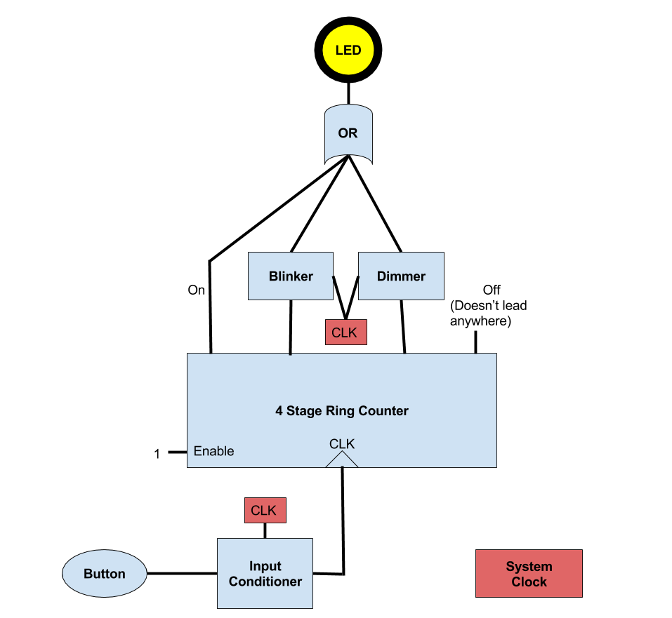

This is a diagram of the system. The button is the user input. If its state changes, the input conditioner (after an appropriate debouncing period) allows that signal to pass through to the clock input of the 4-stage ring counter. This means that pressing the button should produce a single simulated clock cycle, allowing the onehot encoding to move the mode over by 1. All of the ring counter's outputs are modified as needed: the on output goes directly to the *OR* gate contolling the LED, the Blinker signal is passed into a circuit to force it to blink, and the Dim signal is passed to a circuit that will produce a %50 PWM cycle. The or gate allows any of the signals from the onehot encoding to drive the LED.

The System Clock is represented by any red box. Drawing all of the neccessary connecting wires would have been messy.