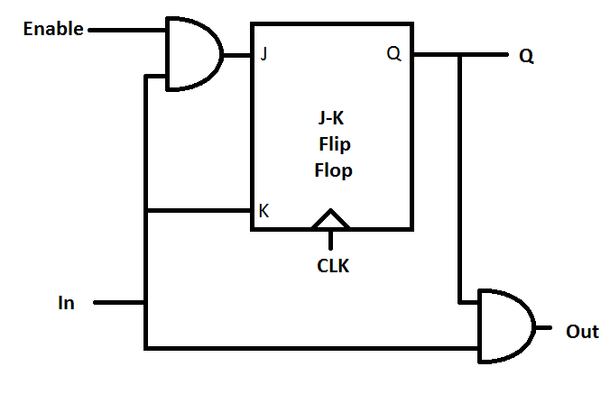
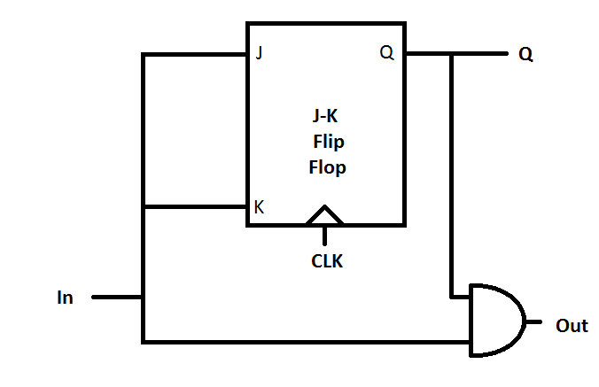
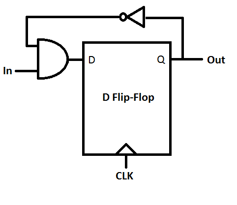

## Schematic

These are the breakdowns of each component used in the creation of the LED controller. Also, for the sake of accounting, this is the total cost of the system, derived from the block diagram.

| Gates                | Cost   |
|----------------------|--------|
| Input Conditioner    |   113  |
| 4-Stage Ring Counter | 21*4-1 |
| Blinker              |   182  |
| Dimmer               |   17   |
| 3-Input OR           |    4   |
| System Clock         |    2   |
Total Cost: 401

# Input Conditioner

The most abstract version of the input conditioner actually looks like this:

This system is a 6 bit counter, that only starts counting when its internal enable signal is high. Since the output to the conditioner is XORed with the input to create the enable signal, this system doesn't start counting untill the input is different from its output - and since the most signifigant bit of the counter is wired to the clock on a flip-flop that holds the output state, its output only changes once the debouncing period is over (when the system counts to 100000b). It also forcibly resets all of the counters if the signal bounces.

- Inputs: IN (a noisy signal), CLK
- Outputs: OUT (a no-noisy signal)

| Gates         | Cost |
|---------------|------|
| 6 Counters    | 16*6 |
| 1 D Flip-Flop |  13  |
| 1 2-Input XOR |   3  |
| 1 Inverter    |   1  |
Total Cost: 113

Each of those counters is a small self contained module:

The counter counts up if its input is high, outtputs high if its own internal state is high, and if the state of its input is high. Q is just its own state. In practice, this allows then to be wired in series, where each one will only count up if all of the previous ones are also high. They also reset to 0 if enable is not true.

- Inputs: IN, Enable, CLK
- Outputs: OUT, Q

| Gates          | Cost |
|----------------|------|
| 1 JK Flip-Flop |  10  |
| 2 2-Input AND  |   6  |
Total Cost: 16

Finally, the bottom of the input conditioner is a J-K flip-flop:

The J-K flip-flop holds state untill the clock goes high. Once it does, if both inputs are high, it flips its state. If J is high, it sets to 1, and if K is high, is resets to 0. This is why they are used in the counter - they are easy to reset, and changing one input switches them from a reset state to a usable state.

- Inputs: J, K, CLK
- Outputs: Q

| Gates          | Cost |
|----------------|------|
| 2 2-Input NAND |   4  |
| 2 3-Input NAND |   6  |
Total Cost: 10

# Blinker

This is the blinker module:

This blinker works almost exactly the same way that the input counditioner does, only it doesn't have an enable signal. It divides the clock signal so that the blinker is turning on and off two times per second, so long as its input is true. It counts to 1111111111111b before reseting to zero.

- Inputs: IN, CLK
- Outputs: OUT

| Gates          | Cost |
|----------------|------|
| 13 Counters    | 13*13|
| 1 JK Flip-Flop |  10  |
| 1 2-Input AND  |   3  |
Total Cost: 182

Each blinker counter is also similar to the conditioner counters:

The counter changes the state of Q when its input is high, and its other output signal is high when both its own state and in the input are high.

- Inputs: IN, CLK
- Outputs: Q, OUT

| Gates          | Cost |
|----------------|------|
| 1 JK Flip-Flop |  10  |
| 1 2-Input AND  |   3  |
Total Cost: 13

The J-K flip-flop has already been described.

# Dimmer

The 50% duty cycle makes this extreamly easy to construct:

It inverts its own state every clock cycle, meaning that it is on %50 of the time, but changing too fast for the human eye to see. It only outputs anything when its own input is high, however.

- Inputs: IN, CLK
- Outputs: OUT

| Gates       | Cost |
|-------------|------|
| D Flip-Flop |  13  |
| 2-Input AND |   3  |
| Inverter    |   1  |
Total Cost: 17

All other components in the controller are described in the Midterm document.

