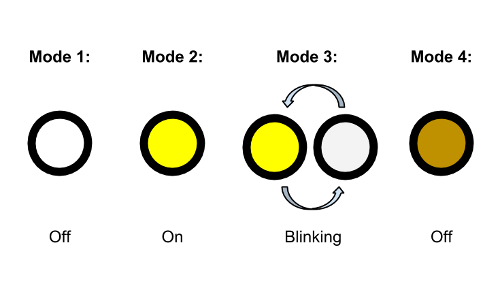

Specification Document
======================

The system examined in this document is an LED bike-light, that can toggle between multiple modes at the press of a button.

# Inputs/Outputs

- The only input for the controller is a button
- The only output for the controller is a single LED light

# Behavior

The bike-light, as mentioned above, can toggle between multiple modes. Those modes are, respectively, *off*, *on*, *blinking*, and *dim*.

