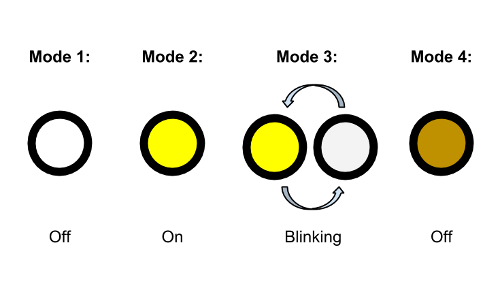
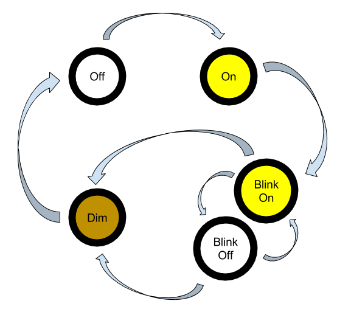
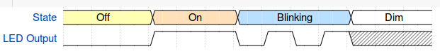

##Specification Document
---

The system examined in this document is an LED bike-light, that can toggle between multiple modes at the press of a button.

# Inputs/Outputs

- The only input for the controller is a button
- The only output for the controller is a single LED light

# Behavior

The bike-light, as mentioned above, can toggle between multiple modes. Those modes are, respectively, *off*, *on*, *blinking*, and *dim*.

These can be rearranged into the finite state machine shown below. If the light is off, it can only turn on. If it is on, it can start blinking. However, once it's blinking, the light can be on or off within that cycle - this on/off pair makes more sense as a second pair of states, because they can both lead to the dim state, while the *on* and *off* states cannot. Finally, the dim light can only turn off.

If you wish, you could also think of it from a timing perspecitve, with the speed that a light is turning on and off.

When it's off, it's off. When it's on, it's on. When it's blinking, it slowly cycles between the two, and when it's dim, it cycles between the two at the system clock speed (represented by the Dim state in the FSM)

# Relevant Dimentions

- The Blinker blinks at 2 Hz
- Button debouncing period is 2^-10 s (~ 1 ms)
- The dim light is at %50, generated by digital PWM at a %50 duty cycle

